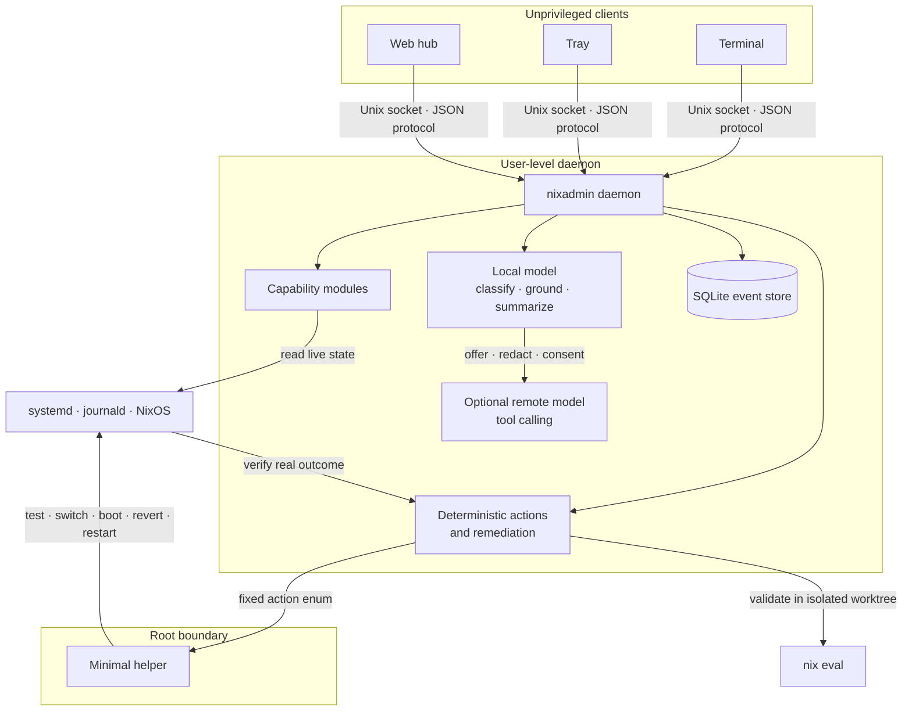

# nixadmin

[](https://github.com/hinstef/nixadmin/actions/workflows/ci.yml)
[](LICENSE)

**A local-first systems agent for NixOS that can explain machine state and take
small, verifiable actions without handing an LLM a root shell.**

`nixadmin` is an ambient observability and remediation layer for a personal
computer. It grounds answers in live system state, notices failures, and offers
or performs narrowly defined fixes. Models interpret intent and evidence;
deterministic code owns actions, privilege, confirmation, rollback, and
verification.

> **Developer preview:** deployed on the author's NixOS laptop and developed in
> public. The current target is intentionally narrow: NixOS, systemd, and COSMIC.
> It is a working personal-system deployment, not yet a general-purpose support
> product.

## What works today

- Answers system questions through an on-device Ollama model grounded in live
  state gathered by capability modules.
- Installs and removes applications through isolated Git worktrees, `nix eval`,
  an explicit diff confirmation, and an atomic NixOS switch.
- Detects failed systemd units, restarts eligible services, verifies the result,
  and stops retrying when a failure persists.
- Presents current health and a persistent event timeline through terminal, tray,
  and web clients.
- Escalates difficult queries to an optional remote model only after showing the
  user a redacted payload and receiving consent.
- Discovers third-party capability modules through a small, typed Python SDK.

## Architecture



The important boundary is not local versus cloud AI. It is **model reasoning
versus system authority**:

- The model never receives a shell or arbitrary root execution.
- Privileged operations cross a Unix socket as a fixed action enum, not a command
  string.
- Configuration changes are validated before confirmation and applied
  atomically; failed activation triggers rollback.
- Runtime remediation is checked after execution, and every observation and
  action is recorded.
- Remote escalation is visible and optional. The reviewed query is redacted
  before it leaves the machine, and locally fetched tool results are scrubbed.

The detailed tradeoffs and known limits are recorded in the
[architecture decisions](docs/adr/).

## One failure, end to end

When a systemd unit fails, the path through the system is deliberately boring:

```text
monitor observes transition
  → daemon records failure
  → deterministic policy selects restart, inform, or skip
  → eligible restart crosses the narrow helper boundary
  → daemon checks the unit's real post-action state
  → outcome is written to the event timeline
  → repeated failure stops the loop and asks for human attention
```

The LLM can explain the evidence, but it does not decide how privilege works or
whether an unverified action succeeded.

## Local and remote models

The two model paths are independent:

| Path | Typical model | Role | System authority |
|---|---|---|---|
| Local | Small Ollama model | Classify, interpret grounded state, summarize | None |
| Remote | LiteLLM-compatible frontier model | Handle queries beyond the local model through tools | None |

Deterministic install/remove and remediation paths do not require a frontier
model. If remote execution is unavailable, `nixadmin` reports that limitation
instead of silently changing behavior.

## Module SDK

A module teaches the daemon about one domain while depending only on the
stdlib-only [`nixadmin.sdk`](src/nixadmin/sdk.py):

```python
from nixadmin.sdk import Fetcher, Module, SPEC_VERSION

manifest = Module(
    spec_version=SPEC_VERSION,
    name="docker",
    description="containers, images, docker, compose",
    fetchers=[
        Fetcher(
            name="ps",
            cmd="docker ps",
            description="Running containers",
        )
    ],
)
```

Third-party packages register the manifest through a standard entry point:

```toml
[project.entry-points."nixadmin.modules"]
docker = "nixadmin_docker:manifest"
```

The repository includes a separate [`nixadmin-extras`](contrib/nixadmin-extras/)
package to exercise the same plugin boundary used by external modules.

## Evaluate the engineering

The complete quality gate is reproducible through Nix:

```bash
nix flake check --print-build-logs
```

It runs the test suite, `mypy` in strict mode, `ruff`, and Nix evaluation. For a
faster development loop:

```bash
nix develop
pytest -q
ruff check src tests contrib
mypy src/nixadmin
```

The tests focus on protocol behavior, routing, safety gates, redaction, rollback,
remediation verification, restart-loop prevention, persistence, and daemon/client
integration. See [`tests/`](tests/) and the accepted
[ADRs](docs/adr/) for the implementation and design record.

## Real deployment

[`nixlap`](https://github.com/hinstef/nixlap) is the public NixOS configuration
used to deploy and operate `nixadmin`. The two repositories intentionally remain
separate: this repository contains the agent and NixOS module; `nixlap` provides
the real declarative machine configuration it reads, validates, and rebuilds.

## Product direction

> **A computer you can give to someone you love.**

The longer-term goal is to make computing adapt to the person rather than require
the person to understand the machine. NixOS and today's models are implementation
choices; the durable idea is a safe, private, explainable loop between human
intent and machine state.

The project deliberately optimizes for trust before breadth: local-first,
reversible, explicit when data may leave the device, and quiet when nothing needs
attention. Read [`docs/vision.md`](docs/vision.md) for the product thinking and
[`docs/PROGRESS.md`](docs/PROGRESS.md) for the detailed build history.

## License

MIT — see [LICENSE](LICENSE).
