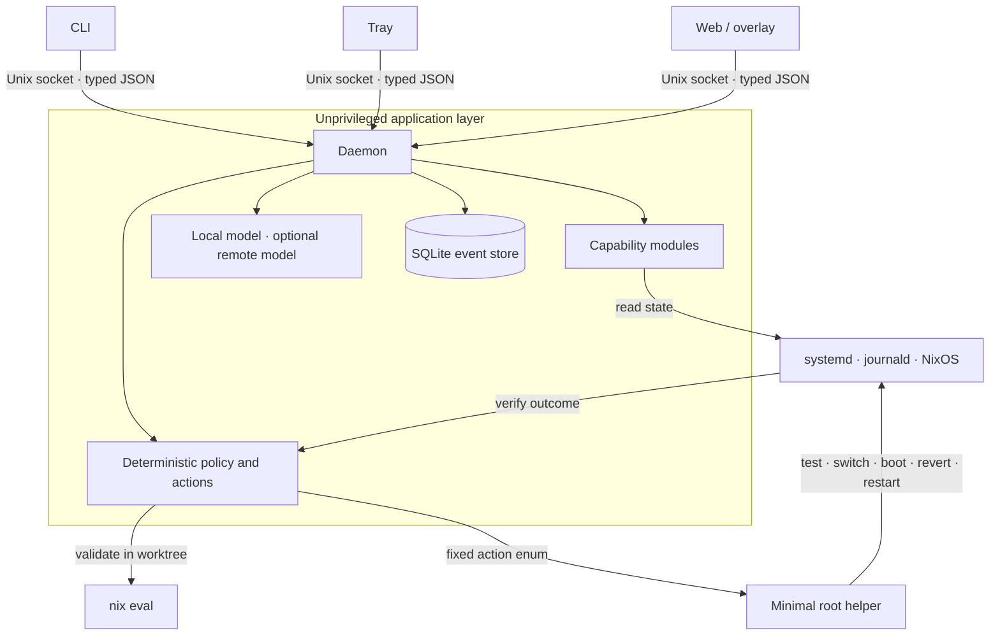

# nixadmin

[](https://github.com/hinstef/nixadmin/actions/workflows/check.yml)
[](LICENSE)

**A local-first systems agent for NixOS that explains machine state and takes
small, verifiable actions without giving an LLM a shell or root access.**

`nixadmin` is an observability and remediation layer for a personal computer.
Models interpret intent and evidence; deterministic code owns actions, privilege,
confirmation, rollback, and verification.

> **Developer preview:** deployed on the author's NixOS laptop. The current target
> is deliberately narrow—NixOS, systemd, and COSMIC—so the implementation can go
> deep instead of pretending to support every Linux environment.

## What works

- Answers system questions through an on-device Ollama model grounded in live state.
- Installs and removes applications through isolated worktrees, evaluation, an
  explicit diff confirmation, and an atomic NixOS switch.
- Detects failed systemd units, restarts eligible services, verifies the result,
  and stops when systemd or nixadmin has already retried unsuccessfully.
- Presents current health and a persistent event timeline through terminal, tray,
  Spotlight-style overlay, and web clients.
- Can use an explicitly configured remote-default model; local-to-remote
  escalation separately requires review of a redacted payload and consent.
- Loads capability modules through a small typed Python SDK.

## Architecture



The important boundary is **model reasoning versus system authority**:

- Models receive no arbitrary command or privileged execution tool.
- Root operations cross a separate socket as a fixed action enum.
- Configuration changes are evaluated before confirmation and applied atomically.
- Failed activation is detected from real exit state and triggers rollback.
- Runtime fixes are verified after execution; observations and actions are recorded.
- Automatic remote escalation is visible, optional, and limited to the reviewed
  redacted text plus deterministically scrubbed tool results. A remote-default
  configuration is an explicit cloud opt-in and sends normal query context.

The current trusted-module and helper-socket limitations are stated in
[`SECURITY.md`](SECURITY.md); design tradeoffs live in [`docs/adr/`](docs/adr/).

## One failure, end to end

```text
observe transition → persist evidence → select restart/inform/skip
→ invoke the narrow helper if needed → verify live state → record outcome
→ refuse another restart when the failure is looping
```

The model may explain the evidence. It does not define privilege or declare an
unverified action successful.

## Engineering decisions

- **Deterministic core, probabilistic edges.** Models classify, summarize, and
  translate; typed policy decides what can change.
- **Explicit privilege boundary.** The user-facing processes remain separate from
  a minimal root helper with an allowlisted protocol.
- **Structured lifecycle ownership.** Async work, client connections, subprocesses,
  timeouts, and shutdown paths have bounded owners.
- **Operational memory.** An append-oriented SQLite timeline supports diagnosis,
  restart-loop prevention, retention pruning, and a human-readable activity view.
- **Backpressure at every boundary.** Socket frames, HTTP bodies, threads, sessions,
  subprocess output, and model context are capped.
- **Reproducible delivery.** Nix builds the package and runs tests, strict typing,
  linting, and NixOS-module evaluation through one command.

## Module SDK

Modules depend on the stdlib-only [`nixadmin.sdk`](src/nixadmin/sdk.py):

```python
from nixadmin.sdk import Fetcher, Module, SPEC_VERSION

manifest = Module(
    spec_version=SPEC_VERSION,
    name="docker",
    description="containers and images",
    fetchers=[Fetcher(name="ps", cmd="docker ps", description="Running containers")],
)
```

They register through the `nixadmin.modules` Python entry-point group. The
[`nixadmin-extras`](contrib/nixadmin-extras/) package exercises the same boundary
used by external modules. Modules are trusted code today; they are not a safe
third-party plugin sandbox.

## Evaluate the engineering

```bash
nix flake check --print-build-logs
```

This runs the complete test suite, strict `mypy`, `ruff`, package evaluation, and
NixOS-module evaluation. For a faster loop:

```bash
nix develop
pytest -q
ruff check src tests contrib
mypy src/nixadmin
```

The tests cover wire compatibility, routing, redaction, privilege gates,
worktree rollback, persistence, lifecycle cancellation, HTTP boundaries, model
tool loops, remediation verification, and restart-loop refusal.

## Scope

The public [`nixlap`](https://github.com/hinstef/nixlap) configuration deploys the
project on a real laptop. This repository contains the application and NixOS
module; `nixlap` contains the declarative machine configuration it operates on.

This is not yet a general-purpose support product. It assumes trusted modules, a
single operator, and the NixOS/systemd/COSMIC stack. Current status and near-term
priorities are in [`docs/PROGRESS.md`](docs/PROGRESS.md); the longer product thesis
is in [`docs/vision.md`](docs/vision.md).

## License

MIT — see [LICENSE](LICENSE).
